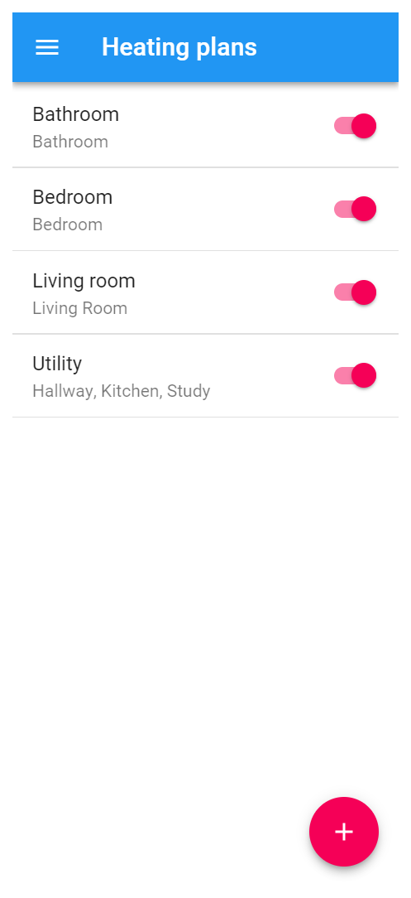
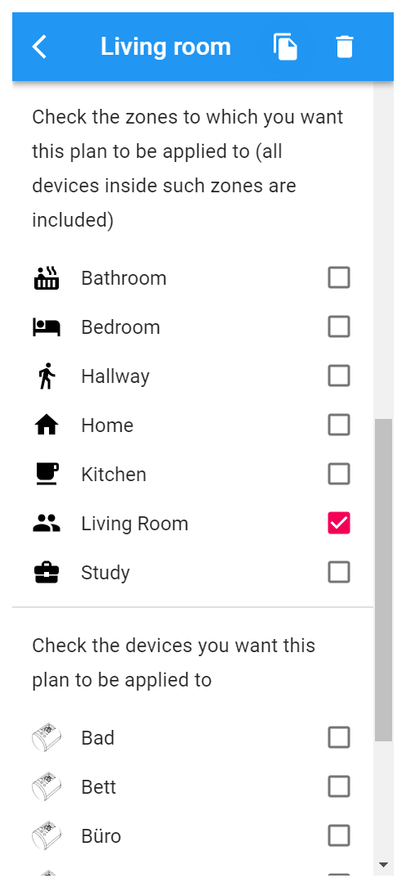
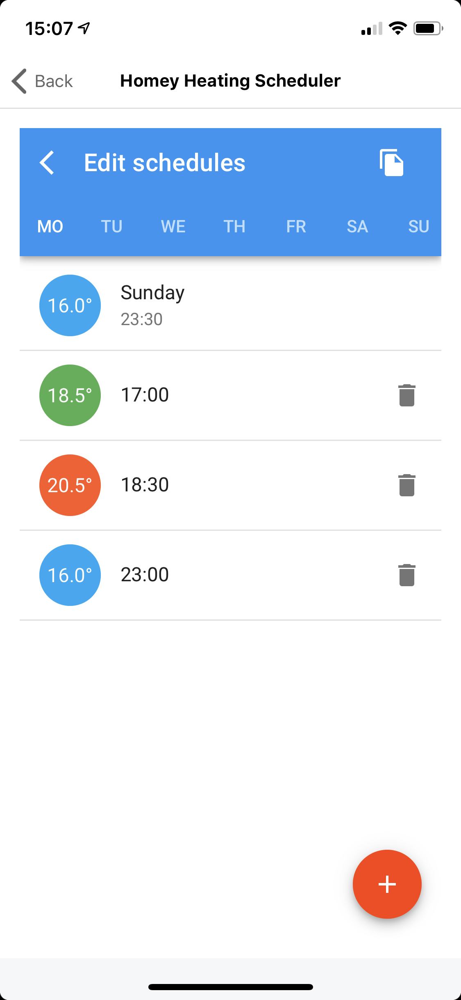

This app controls the target temperature if your thermostats based on *heating plans*. A heating plan is list of set points. At each set point, the associated target temperature is applied to a list devices.

A heating plan can be associated with either zones or devices. If a heating plan is associated with a zone, the heating plan is associated with all themorstats inside that zone. Child zones are not evaluated.

<a href="https://apps.athom.com/app/app.mskg.homey-heating" class="btn">Just let me get started!</a>

## How does that work?
That's just four easy steps
1. Define your heating plan
1. Associate zones and devices to your plan
1. Create your schedule by adding several setpoints

You're good to go.

<screenshots>
    <screenshot>
        
        
Define your heating planes

    </screenshot>

    <screenshot>
        
        
Associate devices with your plan

    </screenshot>

    <screenshot>
        
        
Create a schedule

    </screenshot>
</screenshots>

## Install the App
Navigate to the Homey Apps website and click on install. That's it!

<a href="https://apps.athom.com/app/app.mskg.homey-heating" class="btn">Install Homey Heating Scheduler</a>
