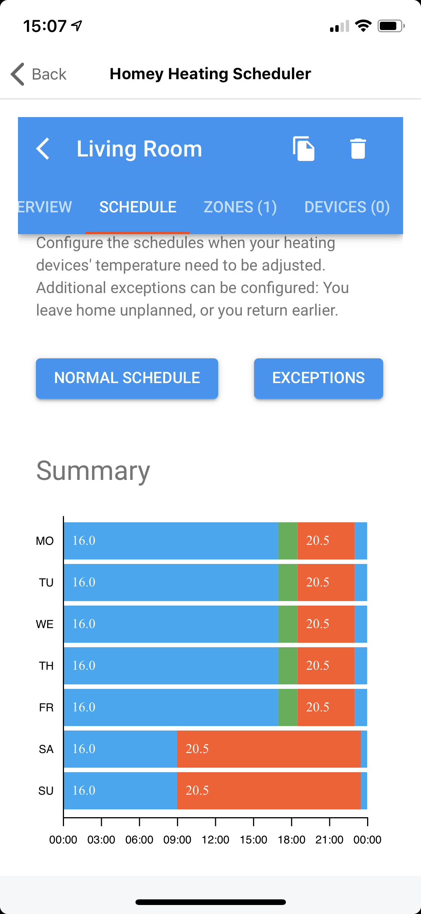
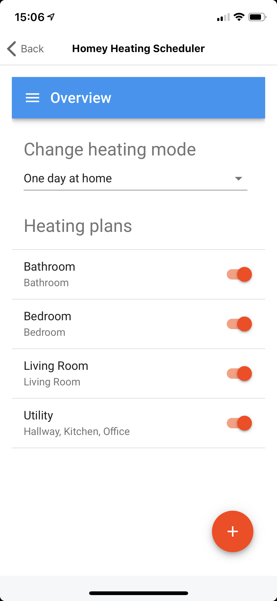

This app controls the target temperature if your thermostats based on *heating plans*. A heating plan is list of set points. At each set point, the associated target temperature is applied to a list devices.

<screenshots>
    <screenshot>
        <crop></crop>
        
Summary screen

    </screenshot>
</screenshots>

A heating plan can be associated with either zones or devices. If a heating plan is associated with a zone, the heating plan is associated with all themorstats inside that zone. Child zones are not evaluated.

<a href="https://apps.athom.com/app/app.mskg.homey-heating" class="btn">Just let me get started!</a>

## How does that work?
That's just three easy steps
1. Define your heating plan
1. Associate zones and/or devices to your plan
1. Create your schedule by adding several setpoints

You're can always save good to go.

<screenshots>
    <screenshot>
        <crop></crop>
        
Define your heating planes

    </screenshot>

    <screenshot>
        <crop></crop>
        
Associate zones with your plan

    </screenshot>

    <screenshot>
        <crop></crop>
        
Create a schedule

    </screenshot>
</screenshots>

## Need many plans?
Nobody likes repetitive work. Such, you can clone schedules and apply a daily schedule to all other days in a week. The actions are available in the application's app-bar, top-right.

<screenshots>
    <screenshot>
        <crop></crop>
        
Duplicate a plan

    </screenshot>

    <screenshot>
        <crop></crop>
        
Copy schedules

    </screenshot>
</screenshots>

## Want to know what the current schedule is?
Once you have setup your schedules, you can look at the current temperatures. This is available via the menu (top-left), *Current temperatures*.

* The avatars on the left show the current setpoint temperature. The colors give you a quick inidcation of the temperature
  * Blue - cold, below 16°
  * Green - eco, below 18.5°
  * Orange - warm, above 20.5°
* The thermostats on the right show the current temperature readings. Blue means the room is warmer than the setpoint - *cooling down*, orange means *warming up*.

<screenshots>
    <screenshot>
        <crop></crop>
        
Overview of current temperatures

    </screenshot>
</screenshots>

## Install the App
Navigate to the Homey Apps website and click on install. That's it!

<a href="https://apps.athom.com/app/app.mskg.homey-heating" class="btn">Install Homey Heating Scheduler</a>
